# Three Octave \#

[![CC BY-SA 4.0][cc-by-sa-shield]][cc-by-sa]

A 38-key (3-octave + 1) keyboard. Powered by [Vial](https://get.vial.today/) firmware.

## Layout

v0.3.0

**Layer 0**:

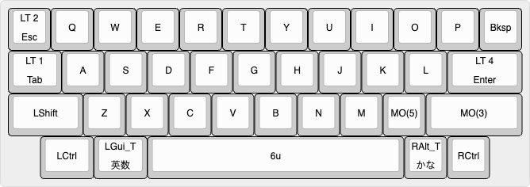

MEMO: I couldn't figure out how to map keys to `fn` on macOS using Vial, so I am using Karabiner-Elements, a macOS app, to modify `right_control` to `fn`.

**Layer 1, 2**: arrows, symbols

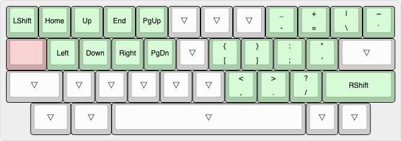
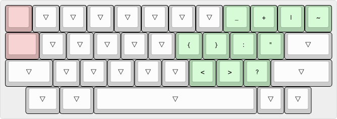

**Layer 3, 4**: nums, symbols

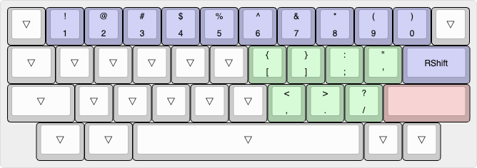
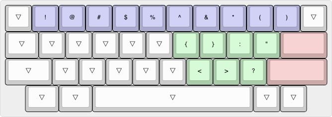

**Layer 5**: fn

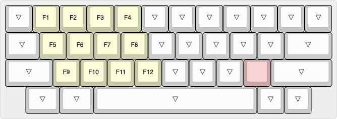

**RAW data for Keyboard Layout Editor v0.15:**

📄 [keyboard-layout.rawdata.json](layout/keyboard-layout.rawdata.json)

```json
[{a:1},"LT 2\nEsc",{a:7},"Q","W","E","R","T","Y","U","I","O","P","Bksp"],
[{a:1,w:1.25},"LT 1\nTab",{a:7},"A","S","D","F","G","H","J","K","L",{a:1,w:1.75},"LT 4\nEnter"],
[{a:7,w:1.75},"LShift","Z","X","C","V","B","N","M","MO(5)",{w:2.25},"MO(3)"],
[{x:0.75,w:1.25},"LCtrl",{a:1,w:1.25},"LGui_T\n英数",{a:7,w:6},"6u",{a:1},"RAlt_T\nかな",{a:7},"RCtrl"],
```

- 🔗 [Keyboard Layout Editor](http://www.keyboard-layout-editor.com/)

## BOM

| Material | QTY | Note |
|-|-:|-|
| Three Octave Sharp PCBA | 1 | |
| Three Octave Sharp Case | 1 | |
| B-0204 | 4 | Screw M2 L4, Hirosugi |
| SIS-2039-05 | 4 | Washer d2 D3.9 t0.5, Hirosugi |
| LUW-0204-075 | 4 | Washer d2.2 D4 t0.075, Hirosugi |

### Three Octave Sharp PCBA

| Material | Symbol | QTY | Note |
|-|-|-:|-|
| Three Octave Sharp PCB | - | 1 | |
| 30pF 402 | C1, C2 | 2 | C1570 |
| 1uF 402 | C3, C4 | 2 | C52923 |
| 100nF 402 | C5-C14 | 10 | C307331 |
| 10uF 402 | C15, C16 | 2 | C15525 |
| HRO_TYPE-C-31-M-12 | J1 | 1 | C165948; USB Type-C Connector, Korean Hroparts Elec |
| 10KΩ 0402 | R1, R3 | 2 | C25744 |
| 1KΩ 0402 | R2, R4 | 2 | C11702 |
| 27Ω 0402 | R5, R6 | 2 | C352446 |
| 5.1KΩ 0402 | R7, R8 | 2 | C25905 |
| Hot_Swap_Socket_CPG151101S11 | SW1-SW38 | 38 | C5156480; How Swap Socket, Kailh |
| SKRPANE010 | SW_B1, SW_R1 | 2 | C470426; Tactile Switch, ALPS ALPINE |
| RP2040 | U1 | 1 | C2040; MCU, Raspberry Pi |
| W25Q64JVXGIQ | U2 | 1 | C2940195, 64M-bit Serial Flash, Winbond Electronics |
| AP2112K-3.3TRG1 | U3 | 1 | C51118, 3.3V Linear Voltage Regulators |
| X322512MSB4SI | Y1 | 1 | C9002, 12MHz 20pF Crystal Resonator, SMD-3225, Yangxing Tech |

📁 [production_data (for JLCPCB at 2024-01-25)](electronics/Three_Octave_Sharp/production/Three_Octave_Sharp_1.0.0_2024-01-25_19-34-58)

### Three Octave Sharp Case

WIP

## Schematic and PCB

📄 [Three_Octave_Sharp.kicad_sch](electronics/Three_Octave_Sharp/Three_Octave_Sharp.kicad_sch) (v1.0.0)

📄 [Three_Octave_Sharp.kicad_pcb](electronics/Three_Octave_Sharp/Three_Octave_Sharp.kicad_pcb) (v1.0.1)


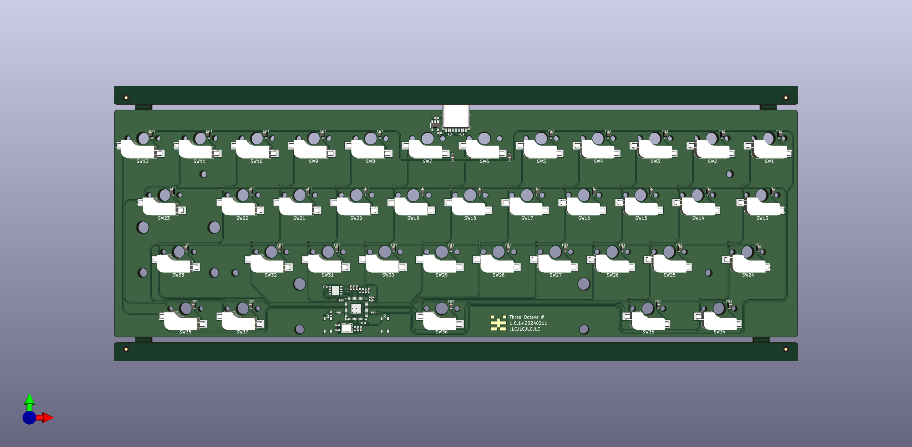

### Key-matrix

|    | C0    | C1   | C2    | C3 | C4 | C5 | C6 | C7 | C8 | C9    | C10    | C11 |
|----|-------|------|-------|----|----|----|----|----|----|-------|--------|-----|
| R0 | Esc   | Q    | W     | E  | R  | T  | Y  | U  | I  | O     | P      | BS  |
| R1 | Tab   | A    | S     | D  | F  | G  | H  | J  | K  | L     | Return |     |
| R2 | Shift | Z    | X     | C  | V  | B  | N  | M  | ,  | Shift | Opt    | Fn  | 
| R3 | Ctrl  | Cmd  | Space |    |    |    |    |    |    |       |        |     |

## Mechanics

The case also functions as a plate.

- 📄 [Three-Octave-Sharp-Case.FCStd](mechanics/Three-Octave-Sharp-Case.FCStd) (v1.0.3)
    - 📄 [Three-Octave-Sharp-Case-Top.step](mechanics/Three-Octave-Sharp-Case-Top.step)
    - 📄 [Three-Octave-Sharp-Case-Bottom.step](Three-Octave-Sharp-Case-Bottom.step)

<div style="display: grid; gap: 1px; grid-template: 'a0 a0 a0 a0' 'a2t a2t a2b a2b' 'a5t a5t a5b a5b' 'a1 a3 a4 a6';">
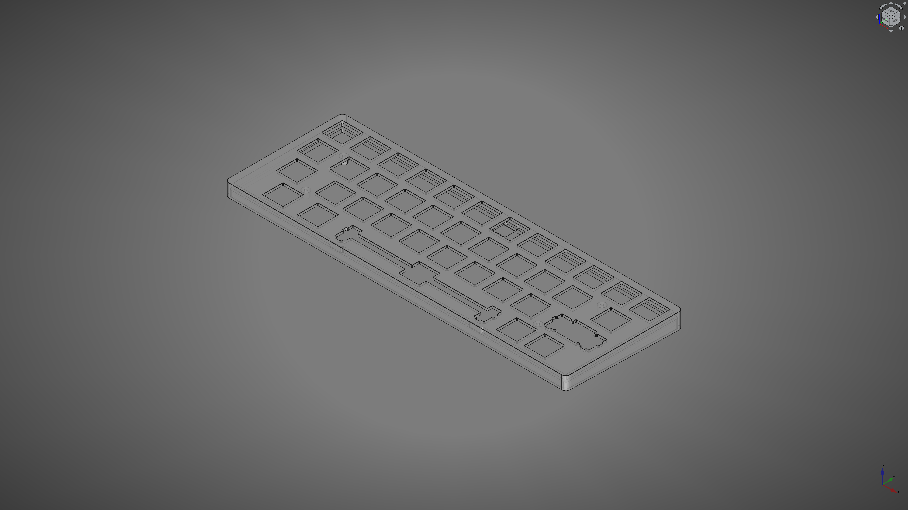
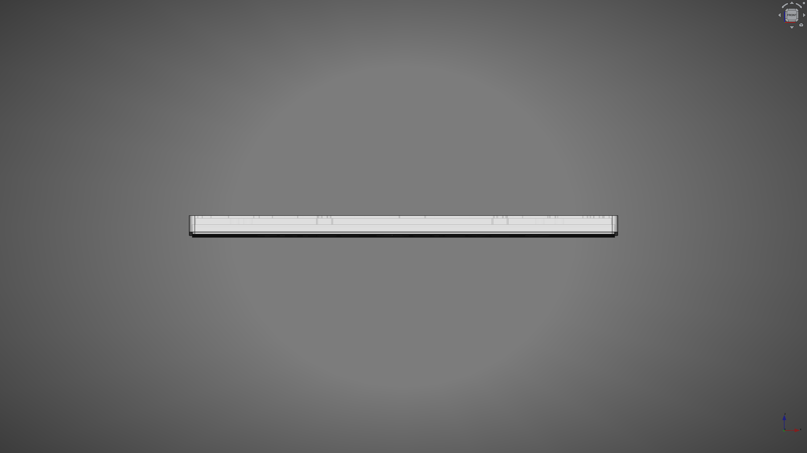
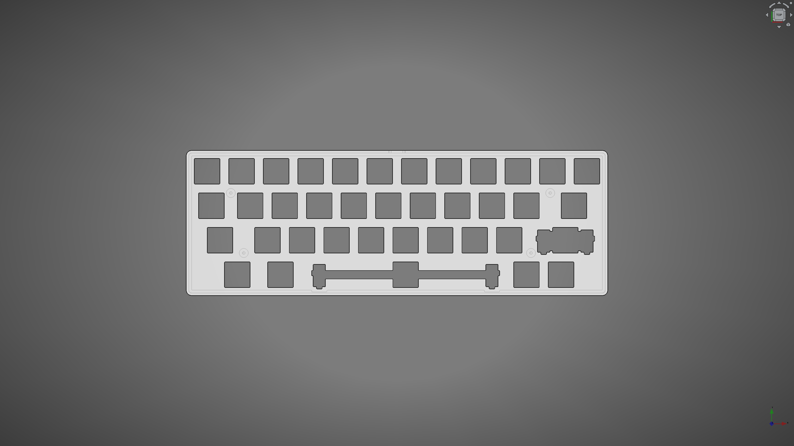
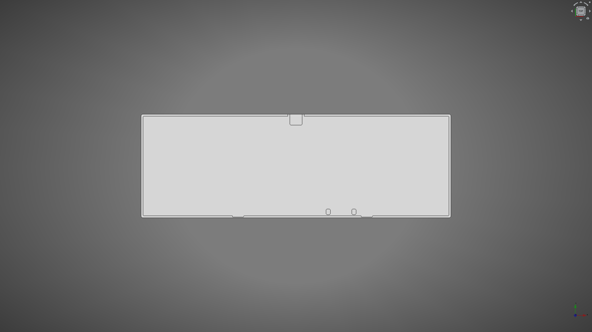
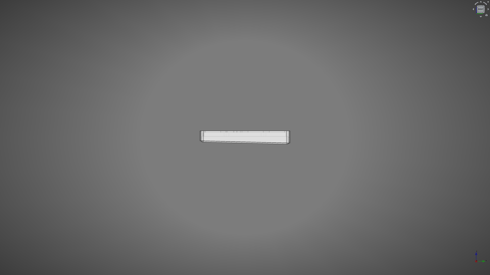
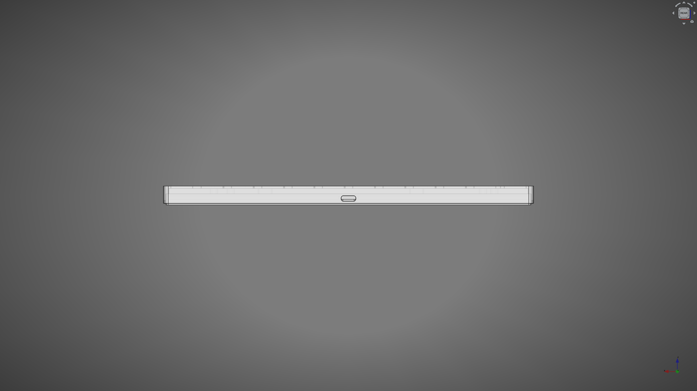
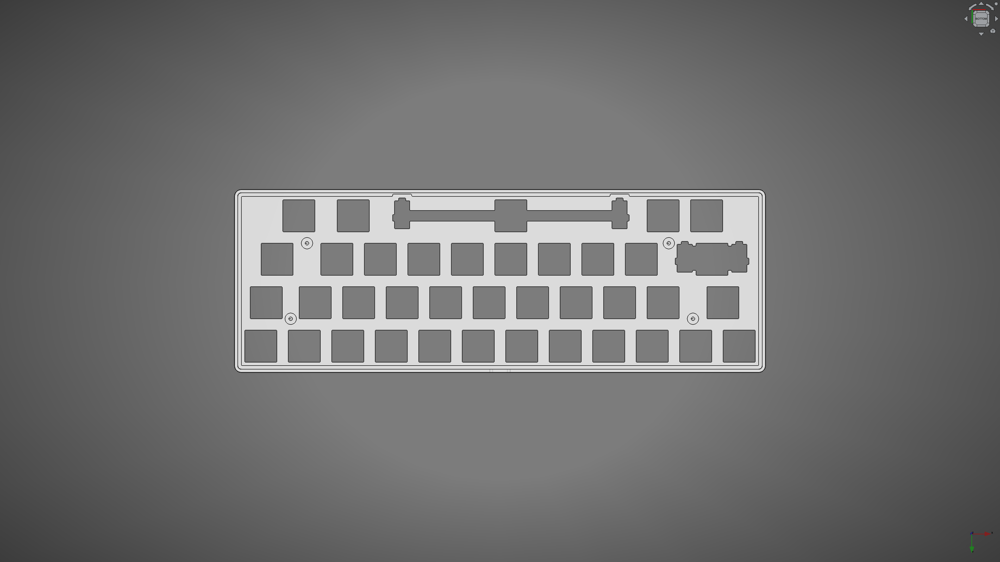
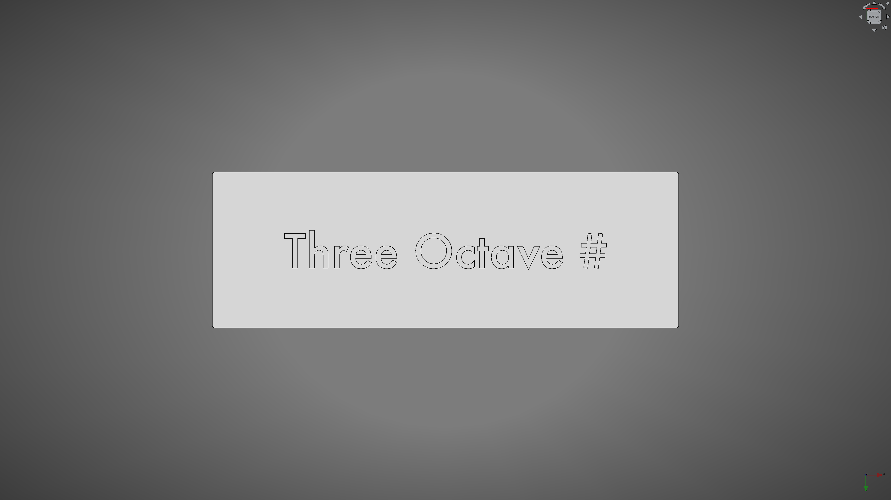
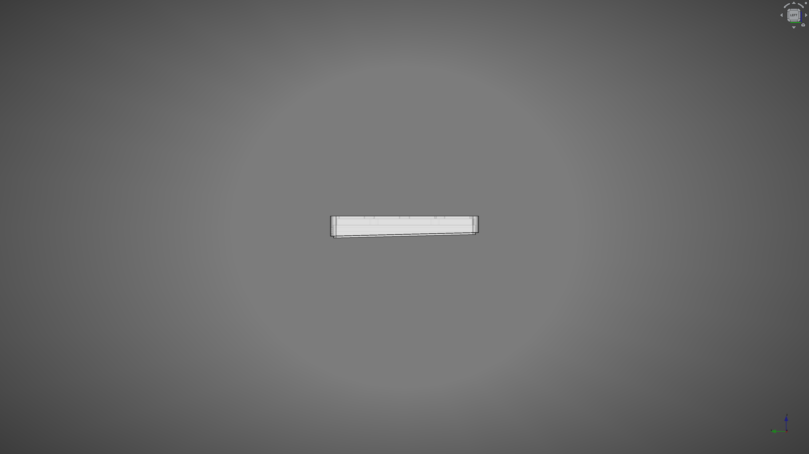
</div>

## Firmware

### Vial

- Built UF2
    - 📄 [takayoshiotake_three_octave_sharp_vial_20240407.uf2](vial-bin/takayoshiotake_three_octave_sharp_vial_20240407.uf2)
- Code
    - 🔗 <https://github.com/vial-kb/vial-qmk/tree/vial/keyboards/takayoshiotake/three_octave_sharp>
    - 🔗 <https://github.com/vial-kb/vial-qmk/tree/bbaed80505cf4ceaeb51d1e5fe79b23b22acf1a6>

See [vial-porting](vial-porting) for more details.

## License

This work is licensed under a
[Creative Commons Attribution-ShareAlike 4.0 International License][cc-by-sa].

[![CC BY-SA 4.0][cc-by-sa-image]][cc-by-sa]

[cc-by-sa]: http://creativecommons.org/licenses/by-sa/4.0/
[cc-by-sa-image]: https://licensebuttons.net/l/by-sa/4.0/88x31.png
[cc-by-sa-shield]: https://img.shields.io/badge/license-CC%20BY--SA%204.0-lightgrey.svg
